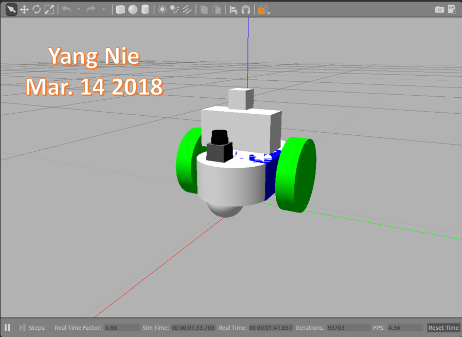
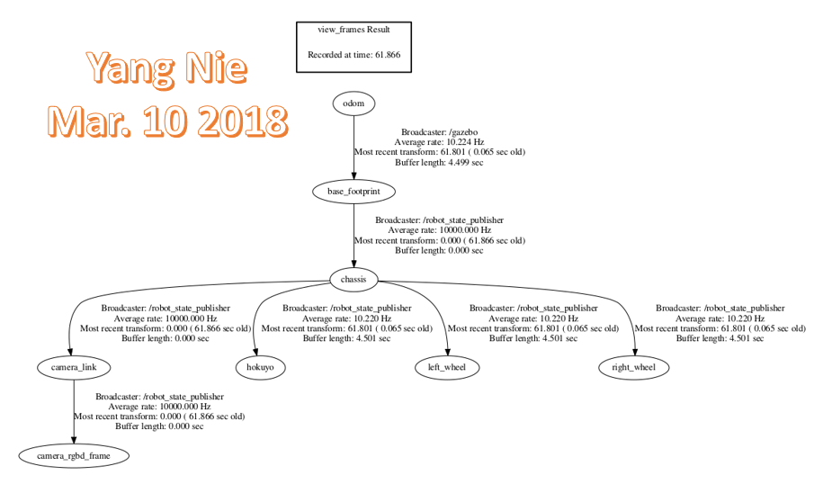
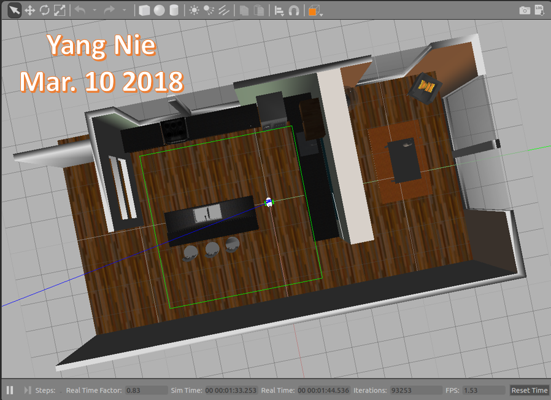
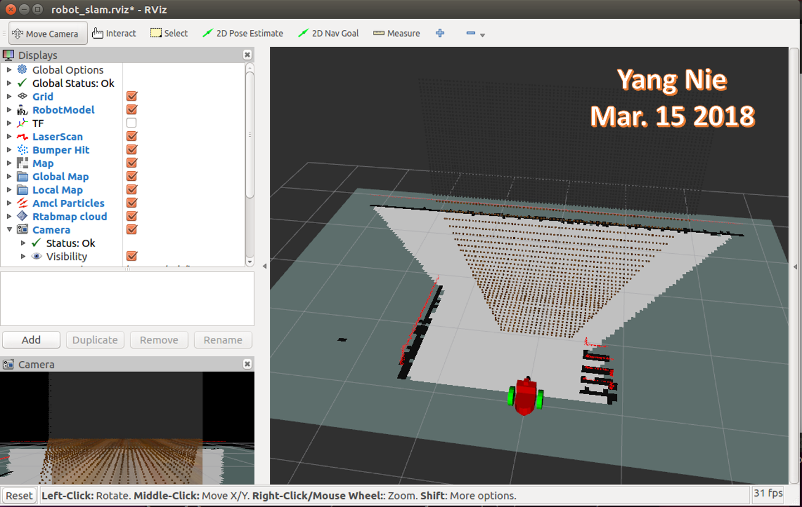
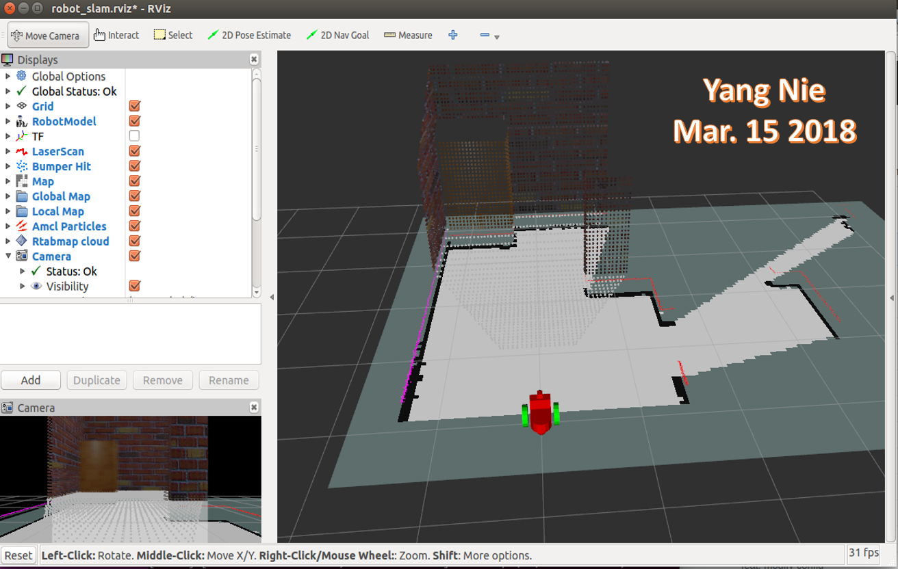
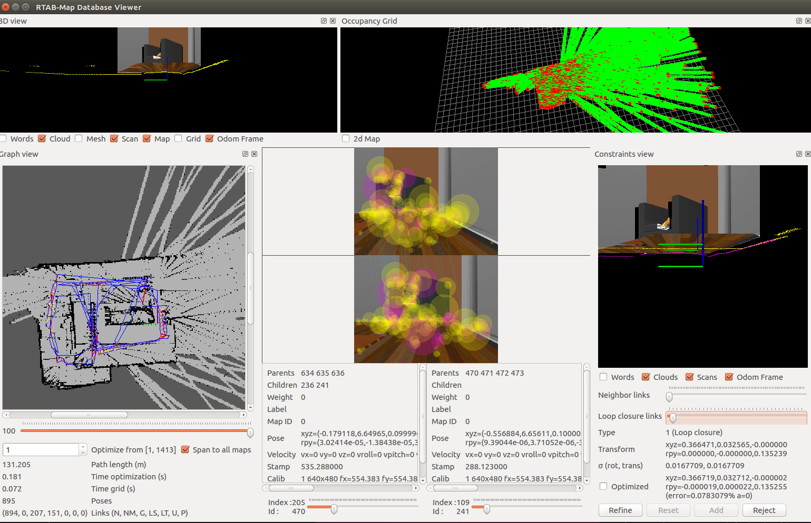
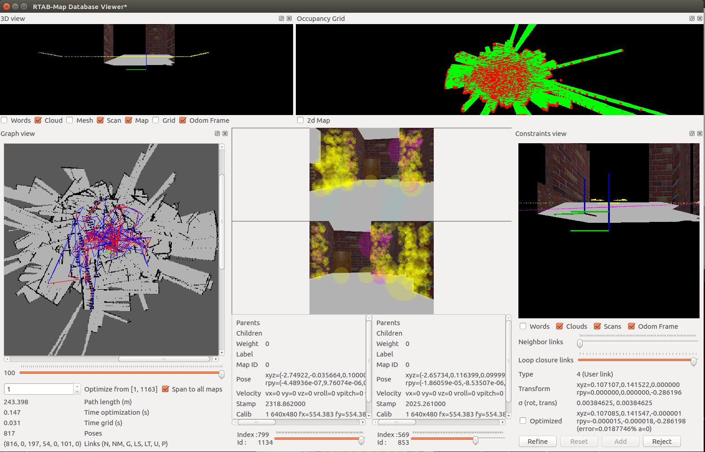

# Udacity Robotics Software Engineer Project
## Term2 SLAM project Lab

## Abstract
This project created the 2D occupancy grid and 3D octomap from a provided kitchen-dinning and auther created rooms-objects simulated environment. It used RTAB-Map package, the best solution for simultaneous localization and mapping (SLAM) algorithm, to develop robots that can map environments in ROS. The results for both   simulated environments will be disciussed in this article.

## Introduction
For robotic mapping and navigation fields, simultaneous localization and mapping (SLAM) is the computational problem of constructing or updating a map of an unknown environment while simultaneously keeping track of an agent's location within it. While this initially appears to be a chicken-and-egg problem there are several algorithms known for solving it, at least approximately, in tractable time for certain environments. Popular approximate solution methods include the particle filter, extended Kalman filter, and GraphSLAM.

SLAM algorithms are tailored to the available resources, hence not aimed at perfection, but at operational compliance. Published approaches are employed in self-driving cars, unmanned aerial vehicles, autonomous underwater vehicles, planetary rovers, newly emerging domestic robots and even inside the human body.[1]

The project focuses on the following several tasks:

* Creating a Catkin workspace under Robot Operatiosn System (ROS) with all launch, worlds, urdf and scripts folders. Installing rtabmap package.
* Building a mobile robot with RGBD camera and laser scanner for simulated tasks.
* Creating a ROS package that launches a robot model in a Gazebo world and utilizes packages like rtabmap, teleop and the RViz.
* Use debug tools to explor, add, and tune specific parameters corresponding to each package to achieve the best possible mapping results.

## Background
Robotic mapping: the goal for an autonomous robot is to be able to construct (or use) a map or floor plan and to localize itself in it[2].

SLAM addresses the main perception problem of a robot navigating an unknown environment. While navigating the environment, the robot seeks to acquire a map thereof, and at the same time it wishes to localize itself using its map. The use of SLAM problems can be motivated in two different ways: one might be interested in detailed environment models, or one might seek to maintain an accurate sense of a mobile robot’s location. SLAM serves both of these purposes.

SLAM are derived: (1) the extended Kalman filter (EKF); (2) particle filtering; (3) graph optimization. 

SLAM algorithms generally fall into these five categories: 
1. Extended Kalman filter SLAM (EKF) 
2. Sparse Extended Information Filter (SEIF)
3. Extended Information Form (EIF)
4. FastSLAM 
5. GraphSLAM 

FastSLAM 
The main advantage of the FastSLAM algorithm is that it uses a particle filter approach to solve the SLAM problem. Each particle will hold a guess of the robot trajectory, and by doing so, the SLAM problem is reduced to mapping with known poses. But, in fact, this algorithm presents a big disadvantage since it must always assume that there are known landmark positions, and thus with FastSLAM the robot is not able to model an arbitrary environment. 

Grid-based FastSLAM
The grid mapping algorithm can model the environment using grid maps without predefining any landmark position. So by extending the FastSLAM algorithm to occupancy grid maps, it can now solve the SLAM problem in an arbitrary environment. While mapping a real-world environment, the mobile robots mostly equipped  with range sensors. The FastSLAM algorithm can be extended and solved the SLAM problem in term of grid maps.

These three different techniques are used to adapt FastSLAM to grid mapping:
1. Sampling Motion 
-p(x_{t} | x_{t-1}^{[k]} , u_{t})p(x 
t
​	 ∣x 
t−1
[k]
​	 ,u 
t
​	 ): 
Estimates the current pose given the k-th particle previous pose and the current controls u.
2. Map Estimation
-p(m_{t} | z_{t}, x_{t}^{[k]} , m_{t-1}^{[k]})p(m 
t
​	 ∣z 
t
​	 ,x 
t
[k]
​	 ,m 
t−1
[k]
​	 ): 
Estimates the current map given the current measurements, the current k-th particle pose, and the previous k-th particle map
3. Importance Weight
-p(z_{t} | x_{t}^{[k]} , m^{[k]})p(z 
t
​	 ∣x 
t
[k]
​	 ,m 
[k]
 ): 
 Estimates the current likelihood of the measurement given the current k-th particle pose and the current k-th particle map.

Loop Closure is the problem of recognizing a previously-visited location and updating beliefs accordingly. This can be a problem because model or algorithm errors can assign low priors to the location. Typical loop closure methods apply a second algorithm to compute some type of sensor measure similarity, and re-set the location priors when a match is detected[1].

Graph-SLAM complexity is linear, according to the number of nodes, which increases according to the size of the map.
By providing constraints associated with how many nodes are processed for loop closure by memory management, the time complexity becomes constant in RTAB-Map.

RTAB-Map (Real-Time Appearance-Based Mapping) is a RGB-D Graph-Based SLAM approach based on an incremental appearance-based loop closure detector. The loop closure detector uses a bag-of-words approach to determinate how likely a new image comes from a previous location or a new location. When a loop closure hypothesis is accepted, a new constraint is added to the map’s graph, then a graph optimizer minimizes the errors in the map. A memory management approach is used to limit the number of locations used for loop closure detection and graph optimization, so that real-time constraints on large-scale environnements are always respected[3]. 
RTAB-Map uses for odometry constrains, not for landmarks to optimize loop closure constrains. 

The robot mapping performance is related a running environment directly, it is so important which hardware and virtual machine configuration were used in this project.

### Hardware:
     Computer model: Surface Pro 4

     Processor: Intel i7-6650U CPU @ 2.20GHz @2.21GHz

     RAM: 16GB

     Operation System: Window 10 Pro

### Virual Machine:

     VMware Workstation 12 Pro, version 12.5.6

     Processor: 2

     Memory: 13.67GB

     Hard Disk: 40 GB

### Software

1. Using an Udacity ROS (Kinetic) package to create a robot simulation environment on VMWare machine. 
This ROS includes Python (2.7), Gazebo (7.10.0) and RViz (1.12.15) packages.

 

2. Using URDF (Unified Robot Description Format) to create the robot model which includes pose, inertial, collision and visual data.  
Two sensors - a RGB-D camera and a laser rangefinder (Hokuyo)[1] was added in this URDF model.

 

3. The Kitchen-Dining map model is used in first part of the project, 

and the created map model is called rooms-objects model.

4. RTAB-Map (Real-Time Appearance-Based Mapping) approach based on a global loop closure detector with real-time constraints. It is used to generate a 3D point clouds of the environment and/or to create a 2D occupancy grid map for navigation.

5. A Python code - teleop.py  was used to send a moving direction messages to the robot.

## Model Configuration

### Follwing folders and files used in this project:

#### 1. Worlds folder
It stores these world files: 
    I. kitchen_dining.world: it is Gazebo in code model package.
    II. new_robot.world: Reused from Localization project
    III. rooms_items.world (Room & Objects): Use Gazebo Building Editor created a new room model. 

#### 2. Luanch folder
It stores these launch files: 

  I. world.launch, world2.launch: 
    
        <launch>
          <include file="$(find slam_project)/launch/robot_description.launch"/>
            <arg name="world" default="empty"/> 
            <arg name="paused" default="false"/>
            <arg name="use_sim_time" default="true"/>
            <arg name="gui" default="true"/>
            <arg name="headless" default="false"/>
            <arg name="debug" default="false"/>

          <include file="$(find gazebo_ros)/launch/empty_world.launch">
            <!--arg name="world_name" value="$(find slam_project)/worlds/new_building.world"/-->
            <arg name="paused" value="$(arg paused)"/>
            <arg name="use_sim_time" value="$(arg use_sim_time)"/>
            <arg name="gui" value="$(arg gui)"/>
            <arg name="headless" value="$(arg headless)"/>
            <arg name="debug" value="$(arg debug)"/>
          </include>

          <node name="urdf_spawner" pkg="gazebo_ros" type="spawn_model" respawn="false" output="screen" args="-urdf -param robot_description -model slam_project"/>
        </launch>

  II. mapping.launch 
    
        <launch>
          <arg name="database_path"     default="rtabmap.db"/>
          <arg name="rgb_topic"   default="/camera/rgb/image_raw"/>
          <arg name="depth_topic" default="/camera/depth/image_raw"/>
          <arg name="camera_info_topic" default="/camera/rgb/camera_info"/>  
          
          <group ns="rtabmap">
            <node name="rtabmap" pkg="rtabmap_ros" type="rtabmap" output="screen" args="--delete_db_on_start">
              <!-- Basic RTAB-Map Parameters -->
              <param name="database_path"       type="string" value="$(arg database_path)"/>
              <param name="frame_id"            type="string" value="base_footprint"/>
              <param name="odom_frame_id"       type="string" value="odom"/>
              <param name="subscribe_depth"     type="bool"   value="true"/>
              <param name="subscribe_scan"      type="bool"   value="true"/>
              <!-- RTAB-Map Inputs -->
              <remap from="scan"    to="/scan"/>
              <remap from="rgb/image"       to="$(arg rgb_topic)"/>
              <remap from="depth/image"     to="$(arg depth_topic)"/>
              <remap from="rgb/camera_info" to="$(arg camera_info_topic)"/>
              <param name="queue_size" type="int" value="20"/>
              <!-- RTAB-Map Output -->
              <remap from="grid_map" to="/map"/>
              <!-- Rate (Hz) at which new nodes are added to map -->
              <param name="Rtabmap/DetectionRate" type="string" value="1"/> 
              <!-- 2D SLAM -->
              <param name="Reg/Force3DoF" type="string" value="true"/>      
              <!-- Loop Closure Detection -->
              <param name="Kp/DetectorStrategy" type="string" value="0"/> 
              <!-- Maximum visual words per image (bag-of-words) -->
              <param name="Kp/MaxFeatures" type="string" value="400"/>  
              <!-- Used to extract more or less SURF features -->
              <param name="SURF/HessianThreshold" type="string" value="100"/>
              <!-- Loop Closure Constraint -->
              <!-- 0=Visual, 1=ICP (1 requires scan)-->
              <param name="Reg/Strategy" type="string" value="0"/> 
              <!-- Minimum visual inliers to accept loop closure -->
              <param name="Vis/MinInliers" type="string" value="15"/> 
              <!-- Set to false to avoid saving data when robot is not moving -->
              <param name="Mem/NotLinkedNodesKept" type="string" value="false"/>
            </node> 
            <!-- visualization with rtabmapviz -->
            <node pkg="rtabmap_ros" type="rtabmapviz" name="rtabmapviz" args="-d $(find rtabmap_ros)/launch/config/rgbd_gui.ini" output="screen">
              <param name="subscribe_depth"             type="bool" value="true"/>
              <param name="subscribe_scan"              type="bool" value="true"/>
              <param name="frame_id"                    type="string" value="base_footprint"/>
              <param name="odom_frame_id"       type="string" value="odom"/>
              <param name="queue_size" type="int" value="20"/>
              <remap from="rgb/image"       to="$(arg rgb_topic)"/>
              <remap from="depth/image"     to="$(arg depth_topic)"/>
              <remap from="rgb/camera_info" to="$(arg camera_info_topic)"/>
              <remap from="scan"            to="/scan"/>
            </node>
          </group>
       </launch>
 
 
  III. teleop.launch 
  
      <launch>
        <node pkg="slam_project" type="teleop.py" name="teleop"  output="screen">
  	       <remap from="teleop/cmd_vel" to="/cmd_vel"/>
        </node>
      </launch>
      
      
  IV. rviz.launch:
  
     <launch>
       <node name="rviz" pkg="rviz" type="rviz" args="-d $(find slam_project)/launch/config/robot_slam.rviz"/>
     </launch>

#### 3. urdf folder
It stores the robot xacro and gazebo files: new_robot.xacro and slam_project.gazebo.

#### 4. scripts folder
It stores these shell script files: 
  I. rtab_run: a shell script to launch kitchen-dinning world
  II. rtab_run1: a shell script to launch rooms-objects world

#### 5. meshes folder
It stores the laser and RBG-D camera dae files: hokuyo.dae and kinect.dae 

## Results
### Testing scenario:
Same robot navigated two different maps to generate 2D/3D maps.

| Kitchen Dining | Rooms Objects |
| :---: | :---: |
|  |  |
|  |  |
|  |  |

### Testing results
#### A robot navigated in two maps and generated .
| | Kitchen Dining | Rooms Objects |
| :---: | :---: | :---: |
| Neighbor |  |  |
| Global Loop closure |  |  |
| Local loop closure by space |  |  |
| Prior link | 6 -7 munites | 4 -5 munites |

The navigation trajectory for both robots is a green line route, the robots arrived to the goal in the end. 
The problem is that robots need to go up then make a cycle turn first in the map (Figure 1) and this cycle turn routing wasted time.
The better navigation approach is followed red line, it goes to the target position directly.  
Anther problem is the robot stuck on the wall in several testings. The program needs to restart to solve this issue.

####  Figure 1.   

## Discussion

* Adjusting the parameter is a big challenge and time consuming job. Those parameters can be changed independently, but they are related eachother. It is impossible that one person tries all possible combination values for all parameters in limited time. A team work needs to assign for achieving the best result.

* AMCL would'n work well for the kidnapped robot problem. The data from laser sensor can help to detect the current new location again, but it is not guarantee that robot gets correct location or takes too long to find a new position.

* A moving robot with MCL/AMCl algorithm can be used warehouse industry to move and delivery good inside the warehouse. This job and working environment have clear start and end positions. 

## Future Work

* Both robots started forward to dead end direction, then turned back to reverse point (Figure 1). The further study needs to involve to find out this is an algorithm issue or parameter turning problem.

* Additional sensor can be added on back of the robot, so the robot can go back and forth without rotating to navigate to the target position.

* Adjusting and trying different parameters are very man power cost work, a database can be built to store these test parameter and result timing data to help adjusting the parameters in the new robots, and use Deep Learning technology to figure out and generate these parameters automatically.

## Reference

[1] Wikipedia, "Simultaneous localization and mapping" https://en.wikipedia.org/wiki/Simultaneous_localization_and_mapping, 2018.

[2] Wikipedia, “Robotic mapping” https://en.wikipedia.org/wiki/Robotic_mapping, 2017.

[3] Introlab, "RTAB-Map" http://introlab.github.io/rtabmap/ 2017

[4] Wikipedia, "Monte Carlo localization" https://en.wikipedia.org/wiki/Monte_Carlo_localization 2018

[5] wiki.ROS.ORG, "Documentation" http://wiki.ros.org/  2018

[6] R. Siegwart, "Mobile Robot Localization" http://www.cs.cmu.edu/~rasc/Download/AMRobots5.pdf 2002

[7] Zuozhi Yang and Todd W. Neller, "A Monte Carlo Localization Assignment
Using a Neato Vacuum with ROS" https://aaai.org/ocs/index.php/AAAI/AAAI17/paper/download/15025/13983 2017

[8] wikibooks.org , "Robotics/Navigation/Localization" https://en.m.wikibooks.org/wiki/Robotics/Navigation/Localization 
