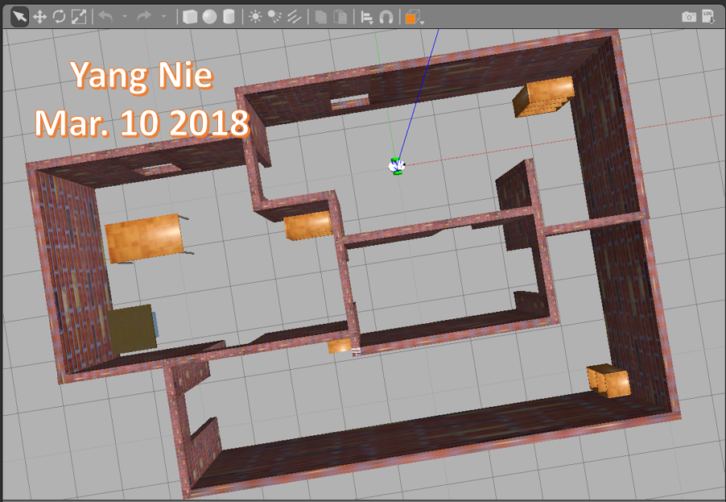

##  Executing instructions for Slam project

#### To execute the first kitchen_dining world in Gazebo:

roslaunch slam_project world.launch  under ~/catkin_ws folder

#### To execute the first kitchen_dining world for all programs

~/catkin_ws/src/slam_project/scripts/rtab_run

#### To execute the second rooms_items world in Gazebo:

roslaunch slam_project world2.launch  under ~/catkin_ws folder

#### To execute the second rooms_items world for all programs

~/catkin_ws/src/slam_project/scripts/rtab_run1

